# LLC Charter Deep Agent — Documentation

## Table of Contents

1. [Overview](#1-overview)
2. [Architecture](#2-architecture)
3. [Project Structure](#3-project-structure)
4. [Configuration](#4-configuration)
5. [Run Mode — Execution Flow](#5-run-mode--execution-flow)
6. [Training Mode — Self-Improvement Flow](#6-training-mode--self-improvement-flow)
7. [Tools Reference](#7-tools-reference)
8. [Pydantic Schemas](#8-pydantic-schemas)
9. [Output Schema (Domain)](#9-output-schema-domain)
10. [Filesystem & Backends](#10-filesystem--backends)
11. [Permissions & Sandboxing](#11-permissions--sandboxing)
12. [Instruction Self-Editing (ILWS)](#12-instruction-self-editing-ilws)
13. [Human-in-the-Loop (HITL)](#13-human-in-the-loop-hitl)
14. [Cost Controls](#14-cost-controls)
15. [Docker Deployment](#15-docker-deployment)
16. [CLI Reference](#16-cli-reference)
17. [Training Data Format](#17-training-data-format)
18. [LangSmith Observability](#18-langsmith-observability)

---

## 1. Overview

This agent extracts structured **legal data from Russian LLC / JSC charters** (Устав) — governing bodies, major-transaction clauses, related-party clauses, restrictions on the sole executive body. The output is a fixed 7-field schema (see §9).

It is built on the **Deep Agents** framework (LangChain / LangGraph) and ships as a single Docker image. The orchestrator decomposes the work, delegates to two specialized subagents (`pdf-reader`, `compute`), verifies each result, then aggregates a final report.

Key properties:

- **Single-shot domain extraction** — every run produces all 7 fields of the OUTPUT SCHEMA.
- **Two named subagents** — `pdf-reader` (docling), `compute` (built-in `execute` tool for shell/python).
- **Per-step few-shot injection** — `search_examples(step_hint=...)` pulls a matching fragment from prior samples before each delegation.
- **Mandatory verification + retry** — every subagent result is checked; failures retry up to 2× then escalate.
- **Self-improving instructions** — training mode scores output, reflects on diffs, edits `process.md` / `tool_tips.md`, re-runs, and rolls back on regression.
- **Containerized by default** — host source files are bind-mounted, so code changes don't require image rebuilds.

---

## 2. Architecture

### 2.1 High-Level

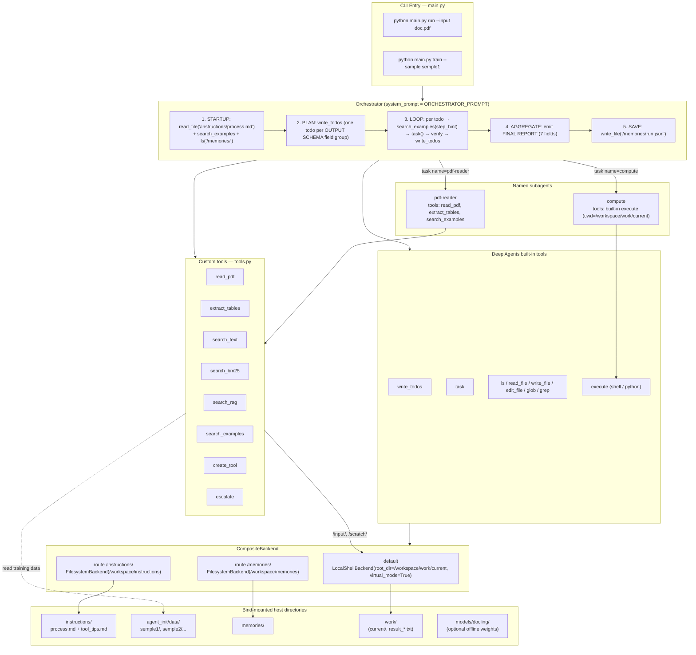

### 2.2 Tool availability matrix

| Tool | Orchestrator | `pdf-reader` | `compute` |
|---|---|---|---|
| `task` (delegate) | ✅ | ❌ | ❌ |
| `write_todos` | ✅ | ❌ | ❌ |
| `ls` / `read_file` / `write_file` / `edit_file` / `glob` / `grep` | ✅ | ✅ | ✅ |
| `execute` (shell/python) | ✅ | ✅ | ✅ (primary tool) |
| `read_pdf` / `extract_tables` | ✅ | ✅ (primary) | ❌ |
| `search_examples` | ✅ (per-step few-shot) | ✅ | ❌ |
| `search_text` / `search_bm25` / `search_rag` | ✅ | ✅ | ✅ |
| `create_tool` | ✅ | ✅ | ✅ |
| `escalate` | ✅ | ✅ | ✅ |

> Subagents inherit all tools **except `task`** by Deep Agents convention. The lists above also reflect what is explicitly attached to each subagent's `tools=` whitelist where applicable.

---

## 3. Project Structure

```
Deep agent/
├── main.py                  # CLI, build_agent(), orchestrator prompt, prepare_run_workspace
├── tools.py                 # Custom tools + virtual path resolver
├── schemas.py               # Pydantic models (Scoring, Reflection, ...)
├── training.py              # load_sample → run → score → reflect → apply → verify → rollback
├── requirements.txt
├── Dockerfile
├── docker-compose.yml
├── .env                     # Secrets (not committed)
│
├── instructions/            # Self-editable; mounted rw into the container
│   ├── process.md           # Domain process (LLC charter extraction)
│   └── tool_tips.md         # Auto-edited by training
│
├── agent_init/
│   ├── buisness_rules.md
│   └── data/                # Training samples
│       └── semple1/
│           ├── input/       # Input PDFs (charters)
│           ├── output/
│           │   ├── reference.json   # Preferred ground truth (matches OUTPUT SCHEMA)
│           │   └── res.txt          # Fallback ground truth
│           └── comments/
│               └── comments.md
│
├── custom_tools/            # Tools created at runtime by create_tool
│
├── memories/                # /memories/ route — long-term notes
├── work/                    # /workspace/work
│   ├── current/             # Per-run scratch (input/, scratch/)
│   └── result_*.txt         # Final reports per run
└── models/
    └── docling/             # Optional offline docling artifacts
```

Inside the container the project is mounted at `/workspace/`. There is no `/app/` anywhere.

---

## 4. Configuration

All config flows through environment variables (loaded from `.env` via `python-dotenv` and `docker-compose`'s `env_file:` directive):

| Variable | Default | Where it's used |
|---|---|---|
| `OPENROUTER_API_KEY` | — | `_build_model()` (LLM auth) |
| `MODEL_NAME` | `google/gemma-4` | LLM model id sent to OpenRouter |
| `MISTRAL_API_KEY` | — | `search_rag` (only if you call it) |
| `MAX_TOKENS_PER_RUN` | `200000` | Quoted in orchestrator prompt as a budget hint |
| `MAX_SUBAGENTS_PER_RUN` | `15` | Quoted in orchestrator prompt as a budget hint |
| `WORK_ROOT` | `/workspace/work/current` | `_resolve_virtual()` in `tools.py`; set by `prepare_run_workspace()` |
| `INSTRUCTIONS_DIR` | `/workspace/instructions` | `training.py` (read/backup/apply edits) |
| `DATA_DIR` | `/workspace/agent_init/data` | `search_examples`, `load_sample` |
| `ACTIVE_SAMPLE` | unset | `search_examples` excludes this sample (set by `train_on_sample`) |
| `DOCLING_ARTIFACTS_PATH` | `/workspace/models/docling` | Used only when the directory is non-empty (offline mode) |
| `LANGCHAIN_API_KEY`, `LANGCHAIN_TRACING_V2`, `LANGCHAIN_PROJECT` | — | Optional LangSmith tracing |
| `HF_TOKEN` | — | Optional, raises HF rate limits when docling downloads weights |

> Budget variables are **soft guidance** — the orchestrator is told the limits in its prompt; there is no hard cutoff in code. LangGraph's recursion limit and OpenRouter's per-call timeouts are the only hard stops today.

---

## 5. Run Mode — Execution Flow

Triggered by `python main.py run --input <path-or-dir>` (typically via `docker compose run`).

### 5.1 Top-level flow

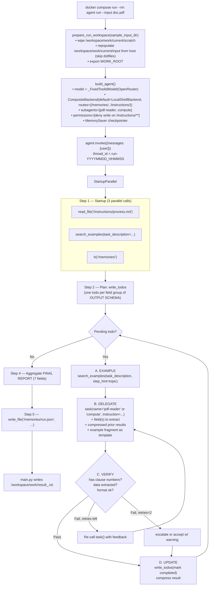

### 5.2 Subagent lifecycle (sequence)

```mermaid
sequenceDiagram
    participant O as Orchestrator
    participant SE as search_examples
    participant T as task()
    participant PR as pdf-reader
    participant C as compute
    participant FS as Virtual FS

    Note over O: Todo: extract major_transaction_clauses

    O->>SE: search_examples(step_hint="major transactions")
    SE-->>O: fragment from semple2/output/reference.json

    O->>T: task(name="pdf-reader",<br/>instruction="extract clauses re: крупные сделки from /input/charter.pdf<br/>example: ...")
    T->>PR: spawn

    PR->>FS: read_pdf("/input/charter.pdf", search="крупн")
    FS-->>PR: "Saved to /scratch/charter_skрупн.md (Total pages: 45)"

    PR->>FS: read_file("/scratch/charter_skрупн.md")
    FS-->>PR: page-scoped markdown with hits
    PR-->>O: clause numbers + texts

    O->>O: verify (clause numbers present?)
    alt Pass
        O->>O: write_todos(mark done)
    else Fail
        O->>T: re-task with feedback (≤ 2 retries)
        T->>PR: spawn again
    end

    Note over O,C: For numeric/aggregation steps:
    O->>T: task(name="compute", instruction="run python on /scratch/x.csv")
    T->>C: spawn
    C->>FS: execute("python -c 'import pandas as pd; df = pd.read_csv(\"scratch/x.csv\"); ...'")
    Note right of C: Inside execute, cwd = /workspace/work/current<br/>so RELATIVE paths are required
    FS-->>C: stdout
    C-->>O: summary
```

### 5.3 Verification retry

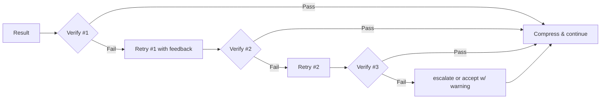

---

## 6. Training Mode — Self-Improvement Flow

Triggered by `python main.py train --sample <name>`. Implementation lives in `training.py::train_on_sample`.

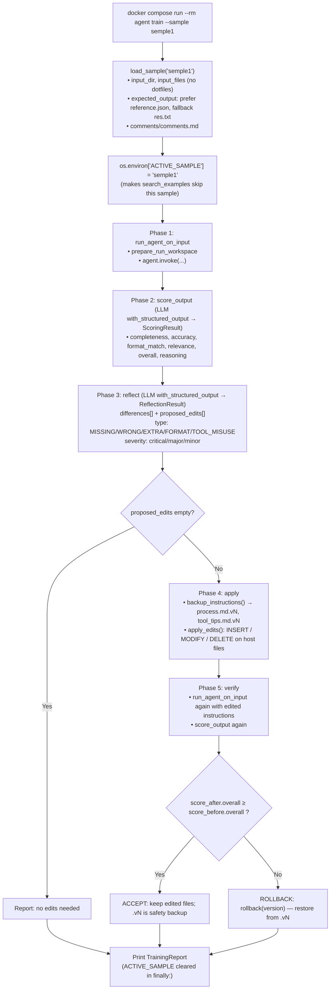

Key implementation notes:

- **`apply_edits` runs on the host filesystem directly**, not via the agent's `edit_file` tool. The `/instructions/**` write-deny permission protects the agent's own tools from corrupting the file mid-run; reflection edits are still able to mutate it because `training.py` uses `pathlib`, not the agent.
- **Backup naming is monotonic**: `process.md.v1`, `.v2`, ... — `backup_instructions()` finds the next free version.
- **Tool-id error guard**: `run_agent_on_input` catches the Minimax-style empty-tool-id `ValueError` and surfaces a friendlier `RuntimeError` suggesting a different `MODEL_NAME`.

---

## 7. Tools Reference

### 7.1 Custom tools (`tools.py`)

| Tool | Args | Returns | Notes |
|---|---|---|---|
| `read_pdf` | `path`, `pages?`, `search?` | "Saved to /scratch/<stem><suffix>.md" | Uses docling. `pages="count"` returns only the page count. `pages` accepts `"5"`, `"3-7"`, `"1,3,5-8"`. `search` does case-insensitive line match with ±1 line context. Always writes the rendered markdown to `/scratch/`. |
| `extract_tables` | `path` | "Extracted N table(s):\n/scratch/...csv" | Each table written as a separate CSV in `/scratch/`. |
| `search_text` | `path`, `query`, `context_lines=2` | matched lines with line numbers | Regex with case-insensitive fallback to literal. |
| `search_bm25` | `path`, `query`, `top_k=5`, `chunk_size=500`, `pattern=""` | top-K chunks by BM25 score | `pattern` (regex) splits the file into chunks instead of fixed-size windows. |
| `search_rag` | `path`, `query`, `top_k=5`, `chunk_size=500`, `pattern=""` | top-K chunks by cosine similarity | Uses `mistral-embed` via `MISTRAL_API_KEY`. |
| `search_examples` | `task_description`, `step_hint?` | per-sample fragments / previews | Skips the sample in `ACTIVE_SAMPLE`. With `step_hint`, extracts the matching markdown section from each sample's `reference.json`/`res.txt`; without it, returns each sample's comments + first 500 chars of output. |
| `create_tool` | `name`, `description`, `code` | "Tool saved to custom_tools/<name>.py" | Validates with `compile()` before saving. |
| `escalate` | `reason`, `context` | human reply or "skip"/"unavailable" | Reads from stdin; in non-tty containers `EOFError` becomes "Human input unavailable. Continue with best effort." |

All file-touching custom tools resolve paths via `_resolve_virtual(path)`, which **only accepts `/input/*` and `/scratch/*`** (everything else is rejected). The `/memories/` and `/instructions/` namespaces are accessed exclusively through the agent's built-in `read_file` / `write_file` / `edit_file` (which are routed by `CompositeBackend`).

### 7.2 Built-in Deep Agents tools (relevant subset)

| Tool | What it does | Backend |
|---|---|---|
| `ls`, `read_file`, `write_file`, `edit_file`, `glob`, `grep` | Virtual filesystem ops | Routed by `CompositeBackend` (paths under `/memories/` and `/instructions/` go to their `FilesystemBackend`; everything else goes to `LocalShellBackend` rooted at `/workspace/work/current`). |
| `execute` | Shell / python execution | `LocalShellBackend.execute`. **cwd = `/workspace/work/current`** so commands must use **relative** paths like `input/...` or `scratch/...` — never `/input/...`. |
| `task` | Delegate to a named subagent | Resolved by `SubAgentMiddleware`. |
| `write_todos` | Maintain a mutable TodoList | Stored in graph state. |

### 7.3 `read_pdf` decision tree

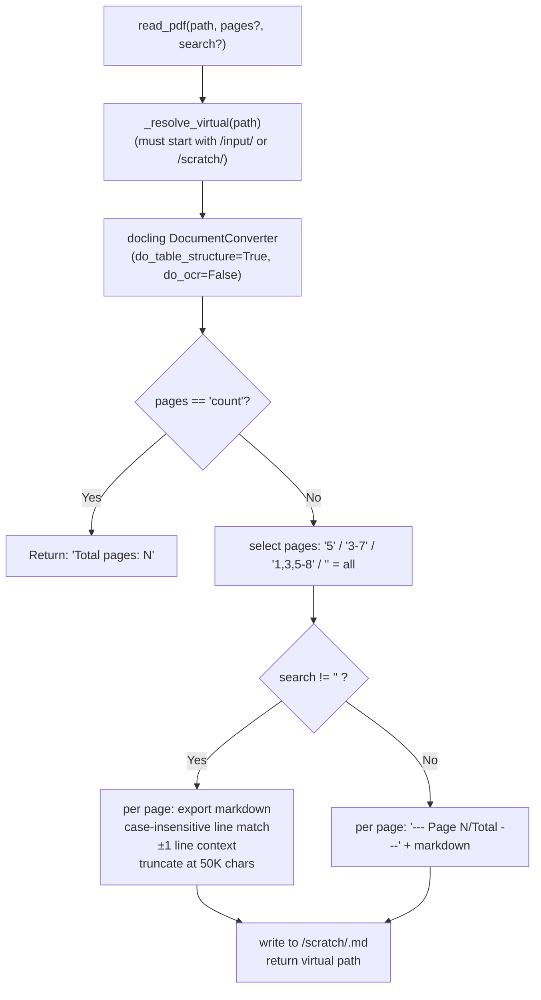

### 7.4 `search_examples` modes

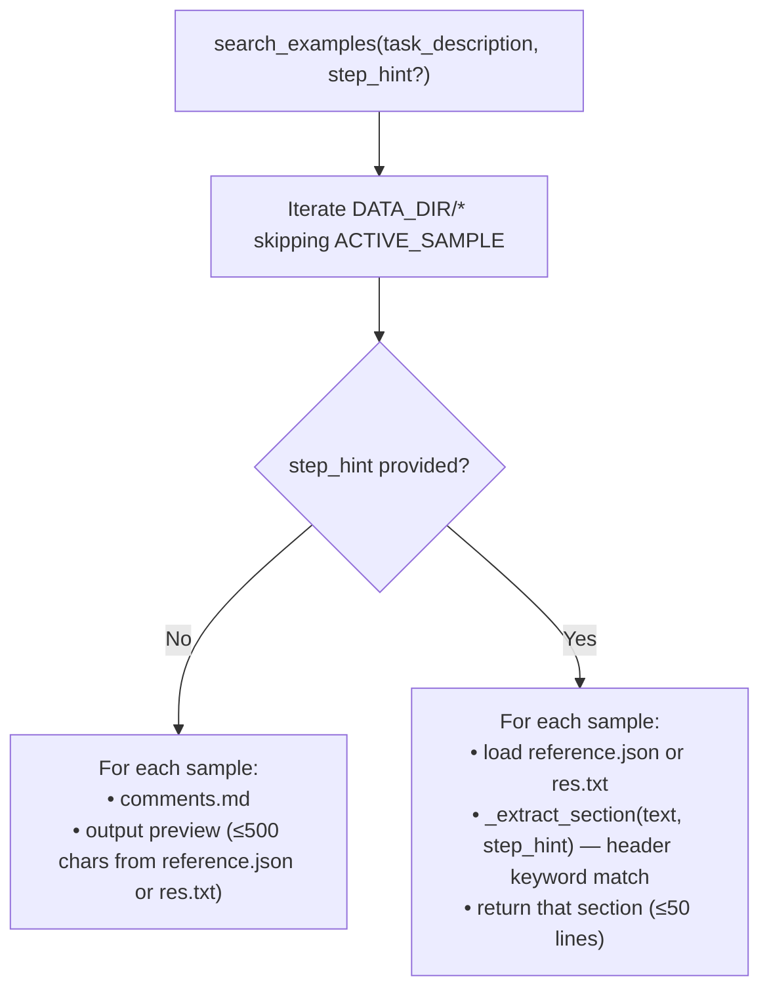

---

## 8. Pydantic Schemas

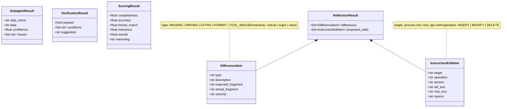

`ScoringResult` and `ReflectionResult` are enforced via `model.with_structured_output(...)` in `training.py`. `SubagentResult` and `VerificationResult` exist for future use — currently the orchestrator does verification in plain text per the prompt.

---

## 9. Output Schema (Domain)

The final report MUST populate all 7 fields. Any field absent from the document is filled with the literal string `"не указано"`.

| Field | Type | Russian semantics |
|---|---|---|
| `supreme_governing_body` | string | Высший орган управления (default: «Общее собрание участников» — always present) |
| `collegial_governing_bodies` | list | Коллегиальные органы (Совет директоров, Наблюдательный совет, Правление, …) |
| `sole_executive_bodies` | list | Единоличные органы (Генеральный директор, Директор, Управляющий, …) |
| `major_transaction_clauses` | list | Пункты о крупных сделках. Each item: `"<clause_number>. <full clause text>"` |
| `related_party_transaction_clauses` | list | Пункты о сделках с заинтересованностью |
| `general_meeting_minutes_protocol` | string | Протокол ОСУ — clause number + method of certification |
| `sole_executive_body_restrictions` | list | Уставные ограничения единоличного ИО (each item with clause reference) |

This schema is embedded verbatim in `ORCHESTRATOR_PROMPT` (`main.py::_OUTPUT_SCHEMA`) and is the canonical contract between the agent, training data (`output/reference.json`), and downstream consumers.

---

## 10. Filesystem & Backends

### 10.1 Virtual layout

| Virtual path | Backend | Real (in-container) | Bind mount (host) |
|---|---|---|---|
| `/input/*` | `LocalShellBackend` (default) | `/workspace/work/current/input/*` | populated per-run from `agent_init/data/<sample>/input/` (no host mount) |
| `/scratch/*` | `LocalShellBackend` (default) | `/workspace/work/current/scratch/*` | wiped at start of each run |
| `/memories/*` | `FilesystemBackend` route | `/workspace/memories/*` | `./memories:/workspace/memories:rw` |
| `/instructions/*` | `FilesystemBackend` route | `/workspace/instructions/*` | `./instructions:/workspace/instructions:rw` |

### 10.2 CompositeBackend wiring (`main.py::build_agent`)

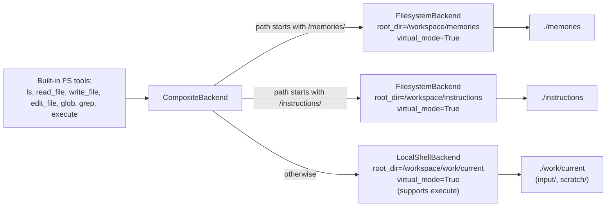

`virtual_mode=True` everywhere means absolute virtual paths cannot escape `root_dir` — `..`, `~`, and host-absolute paths are rejected by the backend before they hit the disk.

### 10.3 Why the route prefixes

- **`/memories/`** is the only namespace meant to outlive a single run.
- **`/instructions/`** is shared between runs and edited by training; route-scoping it lets us apply a `FilesystemPermission` rule (see §11) without tripping deepagents' permission-middleware constraint.
- Everything else maps to the per-run sandbox so leftover state can't leak between runs.

### 10.4 Per-run staging

`prepare_run_workspace(sample_input_dir)` is called by both `cmd_run` and `run_agent_on_input` in training:

1. `rm -rf /workspace/work/current/scratch && mkdir -p` it.
2. `rm -rf /workspace/work/current/input && mkdir -p` it.
3. Copy each non-dotfile from the source dir into `/workspace/work/current/input/`.
4. `os.environ["WORK_ROOT"] = "/workspace/work/current"` so `tools.py::_resolve_virtual` matches the backend.

---

## 11. Permissions & Sandboxing

### 11.1 In-container permissions (`FilesystemPermission`)

```python
permissions = [
    FilesystemPermission(
        operations=["write"],
        paths=["/instructions/**"],
        mode="deny",
    ),
]
```

This single rule prevents the agent's **built-in** `write_file` / `edit_file` from mutating `/instructions/**` during inference. Reflection edits are still possible because `training.py::apply_edits` writes via `pathlib`, bypassing the middleware.

> **Why only this one rule?** deepagents' `_PermissionMiddleware` refuses to install if the default backend supports execution (`SandboxBackendProtocol`) and any rule's path is **not** scoped under a `CompositeBackend` route prefix. With routes `["/memories/", "/instructions/"]`, only patterns starting with one of those two prefixes are accepted. Broader rules (e.g. `/input/**`, `/**`) would raise `NotImplementedError`. See `permissions.py::_all_paths_scoped_to_routes` in deepagents.

### 11.2 Defense in depth

| Layer | Mechanism |
|---|---|
| **Filesystem traversal** | All three backends use `virtual_mode=True` → `..`, `~`, and absolute host paths are rejected. |
| **Custom tools** | `_resolve_virtual()` whitelists `/input/*` and `/scratch/*` only. Everything else returns an error string. |
| **Container** | `python:3.12-slim` image; only the host folders explicitly mounted in `docker-compose.yml` are visible. `agent_init/data/` is mounted **read-only**. |
| **Source code** | `main.py`, `tools.py`, `schemas.py`, `training.py` are mounted **read-only** so the running agent cannot tamper with them. |

### 11.3 What the agent CAN do

- Read anywhere under `/workspace/work/current/{input,scratch}/`, `/workspace/memories/`, `/workspace/instructions/`.
- Write under `/workspace/work/current/scratch/` and `/workspace/memories/`.
- Run any shell or python via `execute` inside `/workspace/work/current/`.
- Read training data via `search_examples` (which goes through `pathlib`, not the agent FS).

### 11.4 What the agent CANNOT do

- Touch the host filesystem outside the bind mounts.
- Mutate its own source code or `/workspace/instructions/`.
- Read `agent_init/data/` via the virtual FS (it's outside the routes).
- Use `task` from inside a subagent.

---

## 12. Instruction Self-Editing (ILWS)

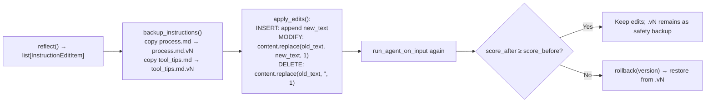

- **Targets** are restricted to `process.md` and `tool_tips.md`. Any other `target` is silently skipped.
- **Operations** are textual: `MODIFY` and `DELETE` operate on first occurrence of `old_text`. The model is responsible for choosing unique enough anchors.
- **No diff/patch validation** — if the model proposes a no-op (`old_text` not found), the file is unchanged and the edit is later rolled back if scoring regresses.

---

## 13. Human-in-the-Loop (HITL)

The only HITL surface today is the `escalate` tool. It reads from the container's stdin:

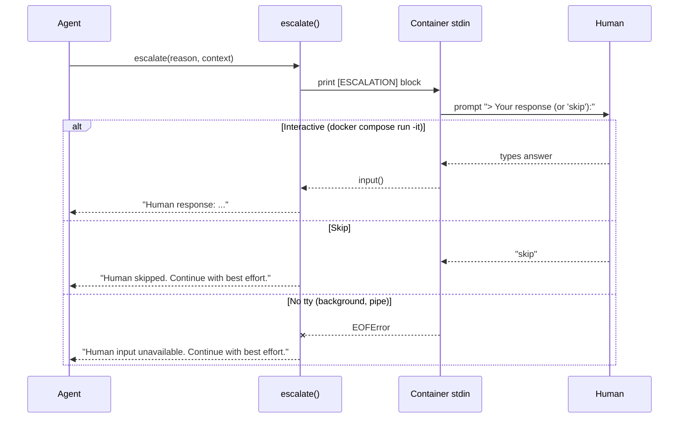

`docker-compose.yml` sets `stdin_open: true` and `tty: true` so interactive escalation works out of the box with `docker compose run --rm agent ...`.

---

## 14. Cost Controls

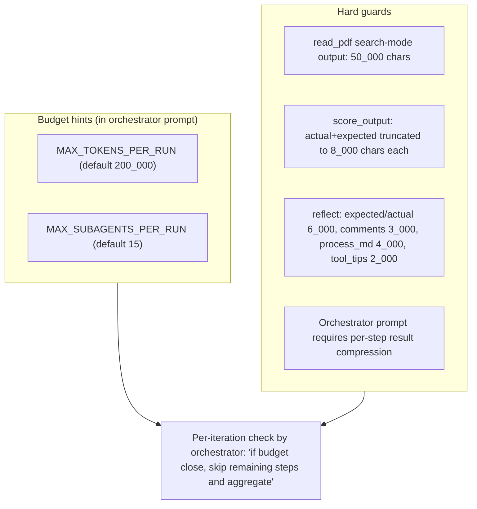

There is currently **no hard enforcement** of `MAX_TOKENS_PER_RUN` / `MAX_SUBAGENTS_PER_RUN` in code — they are quoted into the system prompt and the orchestrator is asked to self-limit.

---

## 15. Docker Deployment

### 15.1 Image layout

```dockerfile
FROM python:3.12-slim

# OS deps:
#   ripgrep         — used by FilesystemBackend's grep tool
#   libgl1, libglib2.0-0, libxcb1, libsm6, libxext6, libxrender1
#                  — runtime libs for cv2 (pulled in by docling's TableFormer)
RUN apt-get update && apt-get install -y --no-install-recommends \
    ripgrep libgl1 libglib2.0-0 libxcb1 libsm6 libxext6 libxrender1 \
 && rm -rf /var/lib/apt/lists/*

WORKDIR /workspace
COPY requirements.txt .
RUN pip install --no-cache-dir -r requirements.txt
COPY main.py tools.py schemas.py training.py ./

RUN mkdir -p /workspace/work/current/input /workspace/work/current/scratch \
             /workspace/instructions /workspace/memories \
             /workspace/agent_init/data \
             /workspace/models/docling

ENTRYPOINT ["python", "main.py"]
CMD ["--help"]
```

### 15.2 Compose service & mounts

```yaml
services:
  agent:
    build: .
    image: deep-agent-app:latest
    env_file: .env
    stdin_open: true
    tty: true
    working_dir: /workspace
    volumes:
      - ./agent_init/data:/workspace/agent_init/data:ro    # samples (RO)
      - ./instructions:/workspace/instructions:rw          # process.md + tool_tips.md
      - ./memories:/workspace/memories:rw                  # long-term memory
      - ./work:/workspace/work:rw                          # current/, result_*.txt
      - ./models:/workspace/models:rw                      # optional offline docling artifacts
      - ./main.py:/workspace/main.py:ro                    # live source (no rebuild)
      - ./tools.py:/workspace/tools.py:ro
      - ./schemas.py:/workspace/schemas.py:ro
      - ./training.py:/workspace/training.py:ro
      - hf-cache:/root/.cache                              # persists HF + docling weights

volumes:
  hf-cache:
```

### 15.3 First-run model download (docling)

On first invocation `docling`'s `StandardPdfPipeline` lazily downloads two models from `ds4sd/docling-models` on Hugging Face:

| Model | Purpose | Approx. size |
|---|---|---|
| Layout / DocLayout | Detect text/table/figure regions | ~150 MB |
| TableFormer | Detect table structure | ~280 MB |

These are cached in the `hf-cache` named volume, so subsequent runs are offline-fast. OCR is **disabled** (`do_ocr=False`) — text-only PDFs only. For scanned docs, set `do_ocr=True` and add a Tesseract OCR backend (the EasyOCR default uses torch and is unstable on `python:3.12-slim`).

To run fully offline, drop the docling artifact bundle under `./models/docling/` on the host. `tools.py` reads `DOCLING_ARTIFACTS_PATH` and uses the directory **only when it is non-empty**, otherwise falls back to HF auto-download.

### 15.4 Common commands

```bash
# Build (only when Dockerfile / requirements change)
docker compose build agent

# Run analysis
docker compose run --rm agent run --input /workspace/agent_init/data/semple1/input/charter.pdf

# Train on a sample
docker compose run --rm agent train --sample semple1

# Interactive shell inside the container
docker compose run --rm --entrypoint bash agent

# Force-rebuild after editing requirements.txt
docker compose build --no-cache agent
```

> Editing `main.py` / `tools.py` / `schemas.py` / `training.py` does **not** require a rebuild — they are bind-mounted read-only into the container.

---

## 16. CLI Reference

```bash
python main.py run --input <path>      # Analyze a document
python main.py train --sample <name>   # Train on a sample (run → score → reflect → apply → verify → rollback)
python main.py --help
```

`--input` accepts either a single file or a directory. Both are staged into `/workspace/work/current/input/`. The first input file is then referenced as `/input/<filename>` in the user message to the orchestrator.

---

## 17. Training Data Format

```
agent_init/data/
└── <sample_name>/
    ├── input/
    │   └── *.pdf                     (PDF charters; dotfiles ignored)
    ├── output/
    │   ├── reference.json            (preferred; matches OUTPUT SCHEMA)
    │   └── res.txt                   (legacy fallback)
    └── comments/
        └── comments.md               (optional human notes)
```

- `reference.json` is preferred everywhere — both `load_sample` and `search_examples` parse it first and only fall back to `res.txt` if it's missing or unparseable.
- Adding a sample: drop a folder under `agent_init/data/`, populate `input/` and `output/reference.json`, then `docker compose run --rm agent train --sample <name>`.
- During training of sample X, `ACTIVE_SAMPLE=X` causes `search_examples` to skip X entirely → no leakage.

---

## 18. LangSmith Observability

If `LANGCHAIN_API_KEY` and `LANGCHAIN_TRACING_V2=true` are set in `.env`, every `agent.invoke` produces a trace with this rough shape:

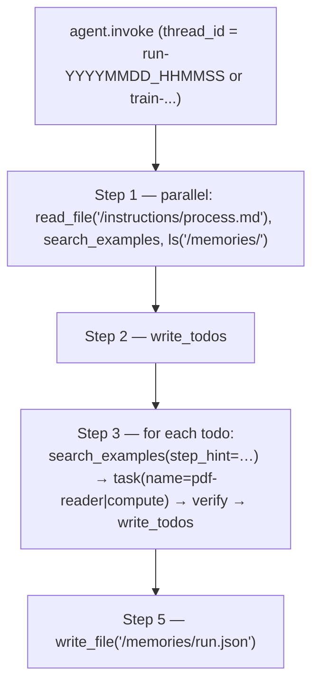

Useful checks per trace:

| Check | Where | Expected |
|---|---|---|
| Startup | First 3 tool calls | `read_file('/instructions/process.md')`, `search_examples`, `ls('/memories/')` — ideally in parallel |
| Few-shot injection | Before each `task()` | A `search_examples` call with non-empty `step_hint` |
| Subagent name | Each `task()` call | `pdf-reader` for parsing, `compute` for shell/python |
| Verification | After each subagent return | Orchestrator inspects result before calling `write_todos(mark complete)` |
| Final report | Last assistant message | All 7 OUTPUT SCHEMA fields populated |
| Memory save | Last tool call | `write_file('/memories/run.json', ...)` |
| Training | Same trace | Phases 1 → 5 visible; Phase 5 only present when edits were proposed |
